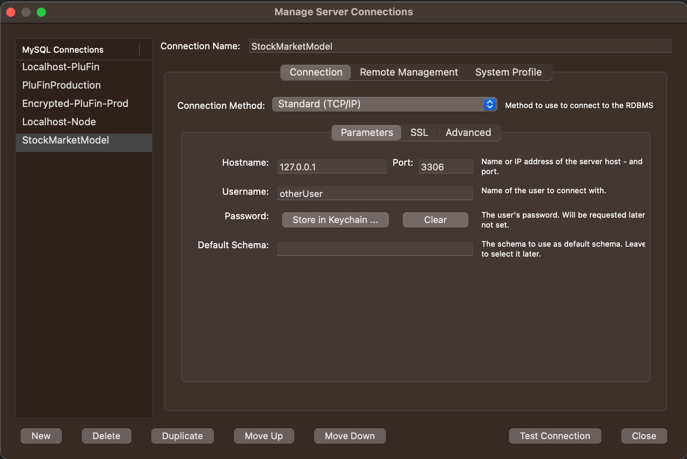

# Docker-MySQL

## Run Docker
Docker file to spin up a MySQL database

Use localhost in the browser to access the container.

To build a container (use whenever you change versions of anything):
```
docker-compose build
```

To create and run the container:
```
docker-compose up -d
```

To stop a specific container:
```
docker stop mysql
```

## Use MySQL Workbench to connect to DB

Connect to the database by using 

Hostname: 127.0.0.1
Port: 3306
Username: [as defined in .env file] otherUser
Password: [as defined in .env file] password

Once this is input, click the button to 'Test Connection'. This should result in a success message, assuming docker is up and running.

